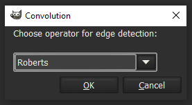
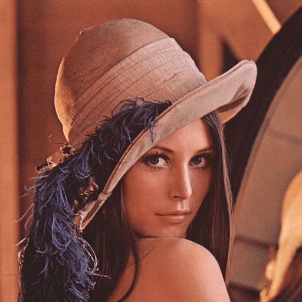
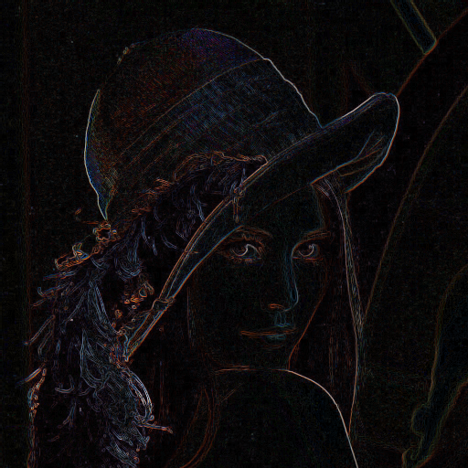
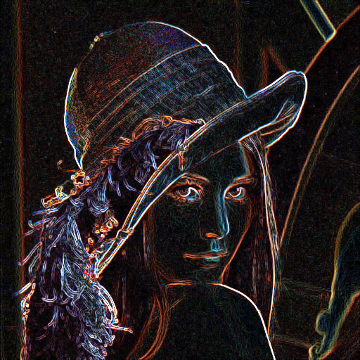
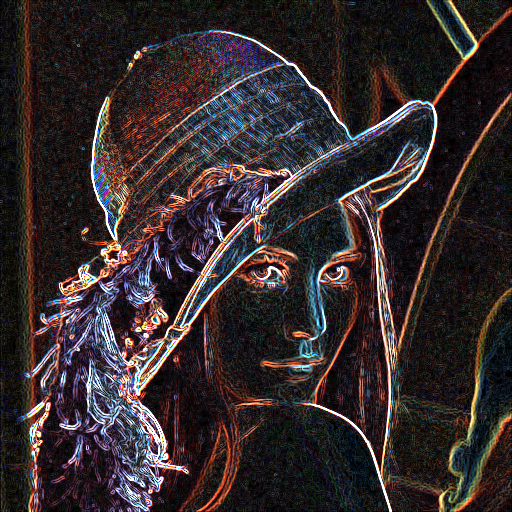
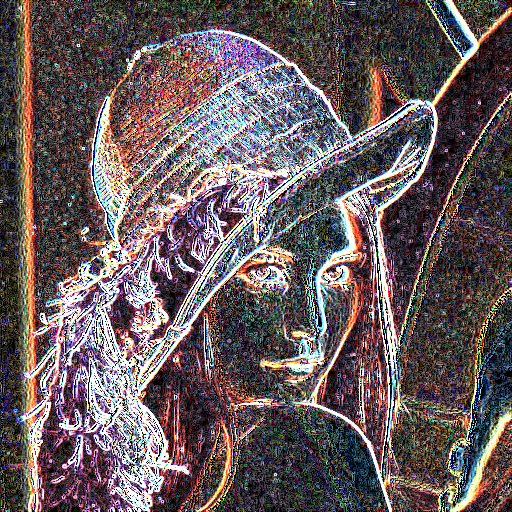
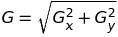

# Konvoluce 1 - Detekce hran

## Uživatelská dokumentace   

### Zadání 

Vytvořte plug-in do GIMPu realizující základní konvoluce pro detekci hran (Roberts, Prewitt, Sobel, 
Robin, Kirsch). Úkolem je realizovat plug-in ktery pro celou aktuální vrstvu provede detekci hran 
konvolucí pomocí základních maticových operátorů. Nezapomentě vhodně reagovat na okrajích obrázku! 
Lze získat 5 dodatečných bodů při vytvoření vhodného UI pro výběr druhu detektoru.

### Skript ke stažení   

link:convolution.py[*convolution.py*]   

### Instalace pro Linux

1. Stažení skriptu
2. Vlastnit nebo stáhnout verzi 2.8 programu GIMP
3. Nainstalovat chybějící knihovny do pythonu (numpy, array, gtk)
4. Udělit práva pro spouštění pluginu ```chmod +x convolution.py```
5. Přesunutí skriptu do složky pro pluginy programu GIMP. Typicky se jedná o složku /plug-ins. Cestu k ní můžete nalézt v programu GIMP:
   Edit -> Preferences -> Folders -> Plug-Ins. Pak stačí zkopírovat cestu do vyhledávače souborů a po nalezení příslušné složky sem skript vložit.

### Použití    

1. Spustit program GIMP 2.8
2. Otevření jakéhokoliv obrázku typu png, jpg... (nedoporučuji obrázky větší než 4MB)
3. V horní liště jít do Filters -> Convolution
4. Otevře se okno pluginu
5. Vybrat jeden z pěti operátorů na detekci hran
6. Potvrdit výběr tlačítkem OK

 

### Ukázky

#### Originál

   

#### Roberts

   

#### Prewitt

   

#### Sobel

   

#### Robin

image::images/lena-robin.png[width=400]   

#### Kirsch

   


## Technická dokumentace   

Inspiroval jsem se programy ze cvičení předmětu BI-PGA, jejichž autorem je Jiří Chludil,
a z ukázkových prací.

### Teorie

Na celý obrázek využijeme konvoluci s vhodným jádrem, které se liší dle vybraného
operátoru. Každý operátor má navíc rozdílný přístup při využití jádra. U každého
operátoru dojde k rotaci jádra a následnému opětovnému využití konvoluce. Takových 
rotací proběhne dle typu operátoru 2-8. Výsledkem je maximální magnituda ze všech těchto
konvolucí. Využíváme operátory Roberts, Prewitt, Sobel, Robin a Kirsch. Jejich základní
jádra jsou následující:

- Robertsův operátor (2 rotace)

[width="15%"]
|=======
|1 |0
|0 |-1 
|=======

- Prewittův operátor (2 rotace)

[width="20%"]
|=======
|1 |0 |-1
|1 |0 |-1
|1 |0 |-1
|=======

- Sobelův operátor (2 rotace)

[width="20%"]
|=======
|1 |0 |-1
|2 |0 |-2
|1 |0 |-1
|=======

- Robinův operátor (8 rotací)

[width="20%"]
|=======
|-1 |0 |1
|-2 |0 |2
|-1 |0 |1
|=======

- Kirschův operátor (8 rotací)

[width="20%"]
|=======
|5 |5 |5
|-3 |0 |-3
|-3 |-3 |-3
|=======


Výsledná magnituda se pak vypočítá pomocí vzorce 



Ve finále se výsledné hodnoty ještě oříznou tak, aby nebyly vně intervalu 0-255,
jelikož takové barevné spektrum využíváme.

### Implementace funkcí    

#### convolution_filter_plugin_main(self, run_mode, image, drawable)
Hlavní funkce našeho programu, nastavuje zakládní hodnoty, inicializuje tvorbu dialogu, 
volá funkci na provedení detekce hran.

```python
def convolution_filter_plugin_main(self, run_mode, image, drawable):
	# load data from image
	self.image = image
	self.drawable = drawable

	# initialization of a key
	if not shelf.has_key(self.SHELF_KEY):
		shelf[self.SHELF_KEY] = { 
			"operator": 0
		}
	
	# initialization of a dialog
	self.create_dialog()

	# if user clicked ok, we can perform convolution
	self.ok_button.connect("clicked", self.convolution)

	gimp.pdb.gimp_image_undo_group_start(self.image)
	self.dialog.run()
		
	# update the image
	gimp.pdb.gimp_image_flatten(self.image)
	gimp.displays_flush()	
	gimp.pdb.gimp_image_undo_group_end(self.image)
```

#### create_dialog(self)
Funkce, která po zavolání vytvoří uživatelské rozhraní. Výsledkem je jedno malé okénko, 
ve kterém si uživatel může vybrat mezi pěti operátory na detekci hran.

```python
def create_dialog(self):
	# name of the dialog
	self.dialog = gimpui.Dialog("Convolution", "convolution_dialog")
	
	# create table
	self.table = gtk.Table(3, 6, False)
	self.table.set_row_spacings(10)
	self.table.set_col_spacings(10)
	self.table.show()
	
	# initialize container that holds everything together
	self.dialog.vbox.hbox = gtk.HBox(True, 0)
	self.dialog.vbox.hbox.show()
	self.dialog.vbox.pack_start(self.dialog.vbox.hbox, False, False, 0)
	self.dialog.vbox.hbox.pack_start(self.table, True, True, 0)	
	
	# add sentence to guide a user
	self.label = gtk.Label("Choose operator for edge detection:")
	self.label.set_line_wrap(True)
	self.label.set_alignment(0, 0.5)
	self.label.show()		
	self.table.attach(self.label, 1, 2, 0, 1)

	# create a list of items to choose from	
	self.multi_choice = gtk.combo_box_new_text()	
	self.multi_choice.append_text("Roberts")
	self.multi_choice.append_text("Prewitt")
	self.multi_choice.append_text("Sobel")
	self.multi_choice.append_text("Robin")
	self.multi_choice.append_text("Kirsch")

	# respond to user's choice
	self.multi_choice.connect("changed", self.change_operator)
	self.multi_choice.set_entry_text_column(0)
	self.multi_choice.set_active(0)
	self.multi_choice.show()
	self.table.attach(self.multi_choice, 1, 2, 2, 3)

	# create ok and cancel buttons
	self.ok_button = self.dialog.add_button(gtk.STOCK_OK, gtk.RESPONSE_OK)
	self.cancel_button = self.dialog.add_button(gtk.STOCK_CANCEL, gtk.RESPONSE_CANCEL)

	# show dialog
	self.dialog.show()
```

#### change_operator(self, multi_choice)
Registruje změnu, kterou uživatel provedl, když si vybral jiný operátor, než ten základní.

```python
def change_operator(self, multi_choice):
	index = multi_choice.get_active()
	self.operator = index
	return index
```

#### convolution(self, okbutton)
Hlavní funkce pro konvoluci. Zjistí rozměry obrázku, získá pole pixelů, převede ho 
na 3D pole a zavolá funkci na detekci hran podle uživatelem zvoleného operátoru. Poté 
ořízne hodnoty pixelů v intervalu 0-255, převede pole zpět na pole pixelů a výsledek uloží.

```python
def convolution(self, okbutton):
	# init the shelf
	operator = self.multi_choice.get_active()
	shelf[self.SHELF_KEY] = {
		"operator": operator
	}

	x_1, y_1, x_2, y_2 = self.drawable.mask_bounds # image resolution
	bpp = self.drawable.bpp # channels
	width = x_2 - x_1
	height = y_2 - y_1
	
	# get region for read only
	region = self.drawable.get_pixel_rgn(x_1, y_1, width, height, False, False)
	data = array.array("B", region[x_1:x_2, y_1:y_2])

	# conversion 1D array to 3D array, where x_i,j = [R, G, B]
	data = np.asarray(data)
	data = data.reshape(height, width, bpp)

	# conversion to [R, G, B], where R = [x_ij], G = [x_ij], B = [x_ij]
	data = data.transpose()	
	pixels = np.zeros([bpp, height, width])
	for i in range(bpp):
		pixels[i] = data[i].transpose()
	pixels = np.array(pixels, dtype=np.float) # conversion to float

	# use chosen operator on the image
	if operator == 0:
		pixels = self.roberts(pixels, width, height, bpp)
	elif operator == 1:
		pixels = self.prewitt(pixels, width, height, bpp)
	elif operator == 2:
		pixels = self.sobel(pixels, width, height, bpp)
	elif operator == 3:
		pixels = self.robin(pixels, width, height, bpp)
	elif operator == 4:
		pixels = self.kirsch(pixels, width, height, bpp)

	# adjust the value of pixels in range (0, 255)
	pixels = np.clip(pixels, 0, 255)

	# conversion back to 1D array
	pixels_cnt = width * height
	output = np.zeros([pixels_cnt * bpp])	

	# conversion to array of pixels
	for j in range (0, pixels_cnt):
		for i in range (0, bpp):
			output[(bpp*j)+i] = int(pixels[i, j//width, j%width])

	output = np.array(output, dtype=np.int)	
	output = array.array("B", output)
	output = output.tostring()
	
	# update region
	region[0:width, 0:height] = output
```

#### convolve(self, array, kernel, width, height, bpp)
Provede konvoluci pro obrázek a dané jádro, na základě kterého upraví matici tak, aby
se při výpočtech nevypadlo za okraj. Zároveň aktualizuje progress bar.

```python
def convolve(self, array, kernel, width, height, bpp):
	kernel_w, kernel_h = kernel.shape

	# create edges according to the size of the operator
	array_edges = np.zeros([bpp, height + int(kernel_w/2)+1, width + int(kernel_w/2)+1])
	for channel in range(bpp):
		array_edges[channel] = np.lib.pad(array[channel], int(kernel_w/2), 'reflect').astype(np.float)

	# progress bar
	gimp.progress_init("Applying convolution...")

	# apply convolution
	array = np.zeros([bpp, height, width])
	for channel in range(bpp):
		for w in range(kernel_w):
			for h in range(kernel_h):
				array[channel] += kernel[w, h]*array_edges[channel][w : height+w, h : width+h]
			gimp.progress_update(float(h+1)/kernel_h)		
	return array
```

#### _operator_(self, pixels, width, height, bpp)
Místo _operator_ dosadíme roberts, prewitt, sobel, robin, nebo kirsch. Tyto funkce vytváří
konvoluční jádra a volají na ně funkci _convolve_. Následně vypočítají magnitudu mezi výsledky 
konvoluce jednotlivých jader.

```python
def roberts(self, pixels, width, height, bpp):
	# create kernels according to roberts
	kernel_1 = np.array([[1, 0], [0, -1]])
	kernel_2 = np.array([[0, 1], [-1, 0]])

	# perform convolution
	array_1 = self.convolve(pixels, kernel_1, width, height, bpp)
	array_2 = self.convolve(pixels, kernel_2, width, height, bpp)

	# find the greatest magnitude across arrays
	pixels = np.sqrt(array_1*array_1 + array_2*array_2)		
	return pixels
```

```python
def prewitt(self, pixels, width, height, bpp):
	# create kernels according to prewitt
	kernel_1 = np.array([[-1, 0, 1], [-1, 0, 1], [-1, 0, 1]])
	kernel_2 = np.array([[-1, -1, -1], [0, 0, 0], [1, 1, 1]])

	# perform convolution
	array_1 = self.convolve(pixels, kernel_1, width, height, bpp)
	array_2 = self.convolve(pixels, kernel_2, width, height, bpp)

	# find the greatest magnitude across arrays
	pixels = np.sqrt(array_1*array_1 + array_2*array_2)
	return pixels
```

```python
def sobel(self, pixels, width, height, bpp):
	# create kernels according to sobel 
	kernel_1 = np.array([[1, 0, -1], [2, 0, -2], [1, 0, -1]])
	kernel_2 = np.array([[1, 2, 1], [0, 0, 0], [-1, -2, -1]])

	# perform convolution
	array_1 = self.convolve(pixels, kernel_1, width, height, bpp)
	array_2 = self.convolve(pixels, kernel_2, width, height, bpp)
	
	# find the greatest magnitude across arrays
	pixels = np.sqrt(array_1*array_1 + array_2*array_2)
	return pixels
```

```python
def robin(self, pixels, width, height, bpp):
	# create kernels with 8 compass directions
	kernel_1 = np.array([[-1, 0, 1], [-2, 0, 2], [-1, 0, 1]])
	kernel_2 = np.array([[0, 1, 2], [-1, 0, 1], [-2, -1, 0]])
	kernel_3 = np.array([[1, 2, 1], [0, 0, 0], [-1, -2, -1]])
	kernel_4 = np.array([[2, 1, 0], [1, 0, -1], [0, -1, -2]])
	kernel_5 = np.array([[1, 0, -1], [2, 0, -2], [1, 0, -1]])
	kernel_6 = np.array([[0, -1, -2], [1, 0, -1], [2, 1, 0]])
	kernel_7 = np.array([[-1, -2, -1], [0, 0, 0], [1, 2, 1]])
	kernel_8 = np.array([[-2, -1, 0], [-1, 0, 1], [0, 1, 2]])

	# perform convolution
	array_1 = self.convolve(pixels, kernel_1, width, height, bpp)
	array_2 = self.convolve(pixels, kernel_2, width, height, bpp)
	array_3 = self.convolve(pixels, kernel_3, width, height, bpp)
	array_4 = self.convolve(pixels, kernel_4, width, height, bpp)
	array_5 = self.convolve(pixels, kernel_5, width, height, bpp)
	array_6 = self.convolve(pixels, kernel_6, width, height, bpp)
	array_7 = self.convolve(pixels, kernel_7, width, height, bpp)
	array_8 = self.convolve(pixels, kernel_8, width, height, bpp)

	pixels = array_1
	arrays = [array_1, array_2, array_3, array_4, array_5, array_6, array_7, array_8]

	# progress bar
	gimp.progress_init("Applying Robinson operator...")
	progress = 0.0

	# find the greatest magnitude across arrays
	for arr in arrays:		
		for channel in range(bpp):
			for h in range(height):
				for w in range(width):
					if abs(arr[channel, h, w]) > pixels[channel, h, w]:
						pixels[channel, h, w] = arr[channel, h, w]
		progress = progress + 0.1		
		gimp.progress_update(progress)
	return pixels
```

```python
def kirsch(self, pixels, width, height, bpp):
	# create kernels with 8 compass directions
	kernel_1 = np.array([[5, 5, 5], [-3, 0, -3], [-3, -3, -3]])
	kernel_2 = np.array([[-3, 5, 5], [-3, 0, 5], [-3, -3, -3]])
	kernel_3 = np.array([[-3, -3, 5], [-3, 0, 5], [-3, -3, 5]])
	kernel_4 = np.array([[-3, -3, -3], [-3, 0, 5], [-3, 5, 5]])
	kernel_5 = np.array([[-3, -3, -3], [-3, 0, -3], [5, 5, 5]])
	kernel_6 = np.array([[-3, -3, -3], [5, 0, -3], [5, 5, -3]])
	kernel_7 = np.array([[5, -3, -3], [5, 0, -3], [5, -3, -3]])
	kernel_8 = np.array([[5, 5, -3], [5, 0, -3], [-3, -3, -3]])

	# perform convolution
	array_1 = self.convolve(pixels, kernel_1, width, height, bpp)
	array_2 = self.convolve(pixels, kernel_2, width, height, bpp)
	array_3 = self.convolve(pixels, kernel_3, width, height, bpp)
	array_4 = self.convolve(pixels, kernel_4, width, height, bpp)
	array_5 = self.convolve(pixels, kernel_5, width, height, bpp)
	array_6 = self.convolve(pixels, kernel_6, width, height, bpp)
	array_7 = self.convolve(pixels, kernel_7, width, height, bpp)
	array_8 = self.convolve(pixels, kernel_8, width, height, bpp)

	pixels = array_1
	arrays = [array_1, array_2, array_3, array_4, array_5, array_6, array_7, array_8]

	# progress bar 
	gimp.progress_init("Applying Kirsch operator...")
	progress = 0.0

	# find the greatest magnitude across arrays
	for arr in arrays:		
		for channel in range(bpp):
			for h in range(height):
				for w in range(width):
					if abs(arr[channel, h, w]) > pixels[channel, h, w]:
						pixels[channel, h, w] = arr[channel, h, w]
		progress = progress + 0.1		
		gimp.progress_update(progress)
	return pixels
```

### Reference

https://en.wikipedia.org/wiki/Edge_detection

https://www.tutorialspoint.com/dip/robinson_compass_mask.htm

https://en.wikipedia.org/wiki/Kirsch_operator
