# Generování objektů - Batgarage

## Uživatelská dokumentace   

### Zadání 

Vytvořte plug-in generující dle zadaných parametrů objekt/sadu objektů. Může jít o jediný dům parametrizovaný počtem pater a velostí,
o uluci s domy, vlak, housenku řízenou počtem noh...
Body jsou přiděleny v závislosti na koplexnosti generovaného objektu (objektů) 10b (housenka) 30b (ulice).

### Interpretace zadání

Při vymýšlení toho, co budu generovat, jsem si vzpomněl na loňský předmět BI-MGA, ve kterém jsem modeloval Batmobile z filmu 
Temný rytíř (The Dark Knight). Napadlo mě, že by byla škoda tento model nevyužít, a tak jsem se rozhodl vytvořit generátor garáže. 
Inspiraci jsem opět bral přímo z filmu Temný rytíř, kde přesně takovou garáž Batman využívá po tom, co mu shořelo jeho původní sídlo, kde měl 
Batcave. Tato dočasná garáž se nachází v podzemí a jediná cesta na povrch je skrz výtah, který lze do scény také generovat. Jelikož se garáž nachází
v podzemí, zvenku model nevypadá nijak extra dobře, počítá se totiž s tím, že si uživatel vygenerovanou garáž umístí někam pod zem a okolo ní bude 
jen hlína, jako tomu bylo ve filmu.

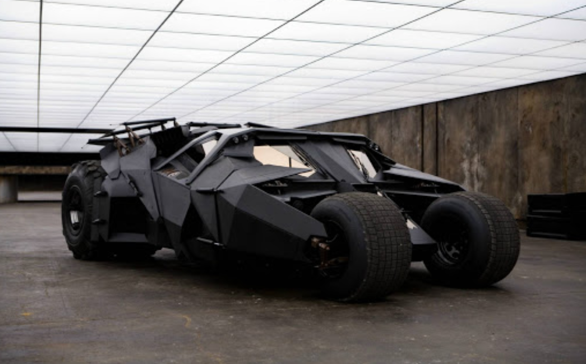 

### Plugin ke stažení   

link:batgarage.zip[*batgarage.zip*]   

### Instalace

1. Stažení pluginu
2. Vlastnit nebo stáhnout verzi 2.80 programu Blender (nejsem si jistý kompatibilitou na vyšší verze, ale mělo by to také fungovat)
3. Otevřít Blender
4. Otevřít Preferences: 
    Edit -> Preferences
    
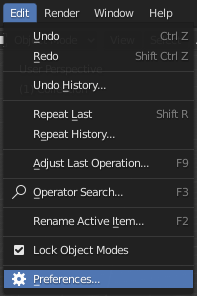 

[start=5]
5. Vybrat záložku Add-ons
6. Kliknout na Install...

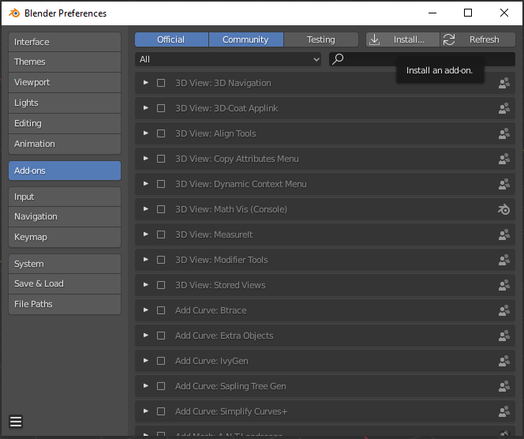 

[start=7]
7. Najít cestu k zazipovanému souboru, který jste stáhli a dvakrát na něj kliknout
8. Plugin se nainstaluje, ještě je třeba ho ve vyhledávacím poli najít a zaškrtnout jeho použití

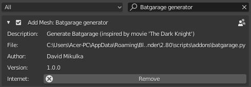 

### Použití    

* Po instalaci pluginu se přidá menu na generování garáže do části *3D Viewport* (lze vyvolat klávesou *N*)

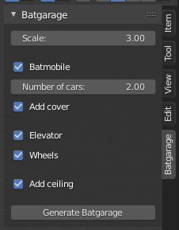 

* V menu pluginu lze zvolit, jak velkou garáž si uživatel přeje - na výběr má ze tří možností, kdy *1* je nejmenší a *3* je největší garáž.

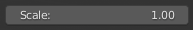

* Dále si uživatel může zvolit to, jestli chce do garáže přidat Batmobile, nebo ne. Pokud si uživatel zvolil velikost garáže 
větší než *1*, má možnost přidat auta dvě. Také je zde možnost přidat na auto deku, která ho přikryje, aby se na něj zbytečně neprášilo.

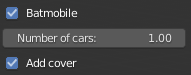

* Uživatel muže do scény nechat generovat výtah na povrch a náhradní kola pro Batmobile. Kola Batmobilu jsou sice neprůstřelná, ale člověk nikdy neví.

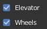

* Poslední volba na uživateli je ta, zda si přeje vygenerovat střechu garáže, či ne. Tato možnost je tu pro lepší volbu umístění kamery při případném renderu,
popřípadě kdyby měl uživatel jiné plány s garáží.


* Zbývá už jen tlačítko *Generate Batgarage*, které vygeneruje všechny objekty tak, jak si je uživatel navolil.

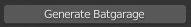

### Ukázky

image::images/render2.png[width=1080] 

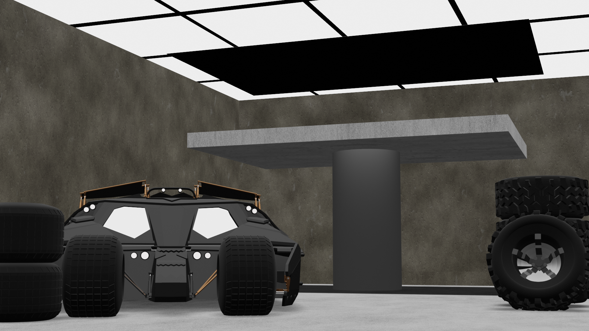 

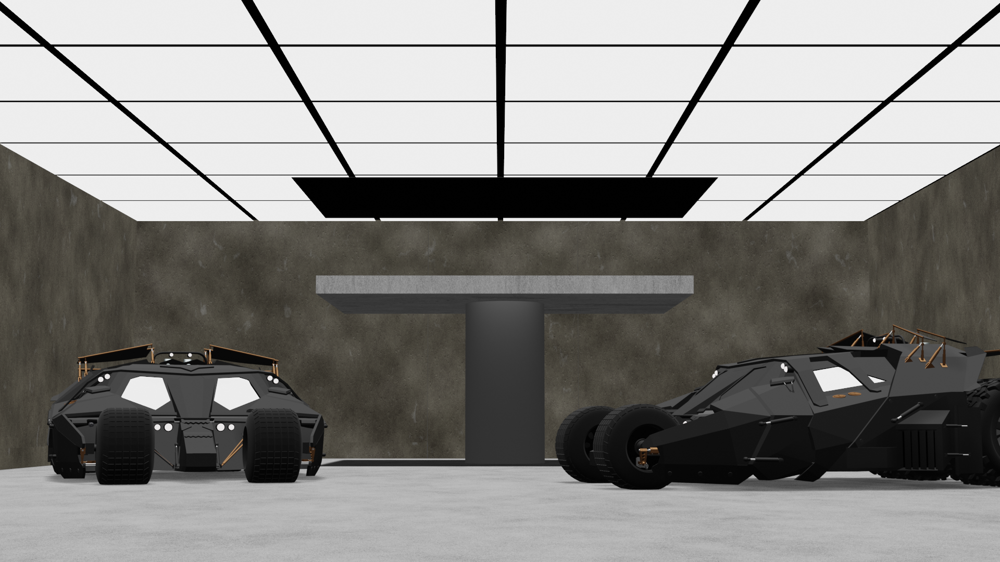 

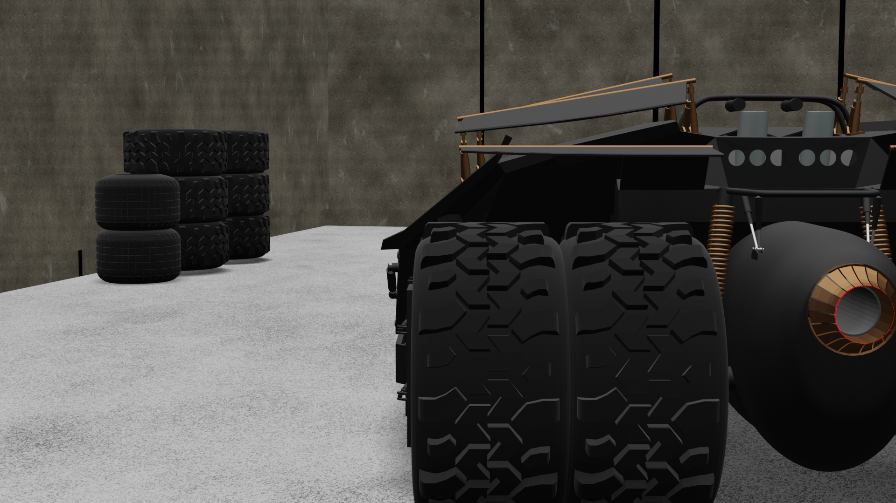 

## Technická dokumentace   

### Fungování pluginu

Plugin se zkládá z jednoho Python skriptu a z jednoho Blender souboru. V souboru batgarage.blend se nachází všechny potřebné modely,
které volá a spravuje skript batgarage.py. Ten také vytváří uživatelský panel se všemi tlačítky, reaguje na uživatelský vstup a následně provádí 
generování celé garáže.

Generování lze spustit pouze v *Object* módu, v jakémkoliv jiném módu nebude okno pluginu k dispozici.

Skript batgarage.py na začátku běhu kontroluje celou aktuální scénu a vyhledává modely se stejný názvem, jako mají modely v souboru batgarage.blend. 
Pokud dojdě ke shodě jmen, plugin se ukončí a vyhodí uživateli hlášku s tím, že nejdříve musí odstranit daný model ze scény, než se 
pokusí generovat garáž. Toto opatření je zde kvůli tomu, že skript batgarage.py pracuje s modely ze souboru batgarage.blend a počítá s 
tím, že mají takové názvy, jako mají v původním souboru. Kdyby se ale ve scéně nacházel nějaký objekt se stejným jménem, objekt ze souboru batgarage.blend 
by se do scény vložil pod názvem _objekt.001_ a plugin by se snažil používat ke generování špatný objekt a mohlo by dojít k nesmyslnému výsledku. 

### Zdrojový kód  

Třída GaragePanel vytváří panel a všechna tlačítka v nabídce Viewport 3D. Zároveň je zde podmínka toho, aby 
uživatel, který se snaží plugin spustit, nebyl v Edit módu. Pokud v Edit módu je, panel z nabídky zmizí.

```python
class GaragePanel(bpy.types.Panel):
    bl_label = "Batgarage"
    bl_space_type = 'VIEW_3D'
    bl_region_type = 'UI'
    bl_category = 'Batgarage'
    
    # panel will show in object mode only
    @classmethod
    def poll(cls, context):
        return context.mode in {'OBJECT'}

    # show buttons in panel
    def draw(self, context):
        layout = self.layout
        scene = context.scene
        my_prop = scene.my_prop

        layout.prop(my_prop, "scale")
        layout.separator()
        layout.prop(my_prop, "batmobile")

        if my_prop.batmobile == True:
            if my_prop.scale > 1:
                layout.prop(my_prop, "batmobile_number") 
            layout.prop(my_prop, "cover")

        layout.separator()
        layout.prop(my_prop, "elevator")
        layout.prop(my_prop, "wheels")
        layout.separator()
        layout.prop(my_prop, "ceiling")
        layout.separator()
        layout.operator("gen.batgarage")
```

Další třída jménem MySettings definuje tlačítka v uživatelském panelu. Je zde celkem 7 tlačítek. 

* _scale_ definuje velikost garáže, na výběr jsou tři možné velikosti. 

* _batmobile_ je jednoduché tlačítko na výber toho, zda bude auto ve scéně, či nikoliv

* _batmobile_number_ určuje počet aut a uživateli se zobrazí jen v případě, že si vybral velikost scény 2 nebo 3

* _cover_ tlačítko přidává možnost hodit na auto deku

* _elevator_ umožňuje přidat do scény výtah

* _wheels_ přidá do scény náhradní kola Batmobilu

* _ceiling_ vygeneruje do scény také strop se světly

```python
class MySettings(bpy.types.PropertyGroup):
    # scale floor with walls, 3 possible sizes of garage
    scale = bpy.props.FloatProperty(
        name = 'Scale', 
        description = 'Adjust size',
        default = 1,
        min = 1,
        max = 3,
        step = 100
    )  

    # show or hide batmobile
    batmobile = bpy.props.BoolProperty(
        name = 'Batmobile', 
        description = 'Add Batmobile',
        default = False
    )
    
    # add second batmobile
    batmobile_number = bpy.props.FloatProperty(
        name = 'Number of cars', 
        description = 'Select number of cars',
        default = 1,
        min = 1,
        max = 2,
        step = 100
    )

    # add cover to the batmobile
    cover = bpy.props.BoolProperty(
        name = 'Add cover', 
        description = 'Add Cover over the Batmobile',
        default = False
    )

    # show or hide elevator
    elevator = bpy.props.BoolProperty(
        name = 'Elevator', 
        description = 'Add Elevator',
        default = False
    )  

    # show or hide random wheels placement according to the size of the garage 
    wheels = bpy.props.BoolProperty(
        name = 'Wheels', 
        description = 'Add random wheels',
        default = False
    )

    # add ceiling 
    ceiling = bpy.props.BoolProperty(
        name = 'Add ceiling', 
        description = 'Add ceiling to the scene',
        default = False
    )
```

Třída MyBagarage se stará o volání funkcí na generování garáže. Na jejím začátku ve funkci _execute_ je navíc volání funkce na již zmíněou 
kontrolu duplicity názvů objektů. V kladném výsledku je plugin ukončen a uživateli vyhozena chybová hláška.

```python
class MyBatgarage(bpy.types.Operator):
    bl_idname = "gen.batgarage"
    bl_label = "Generate Batgarage"
    
    def execute(self, context):
        # check if there are objects with the same names
        if check_scene(self):
            return {"CANCELLED"}

        scene = context.scene
        my_prop = scene.my_prop
        
        #path to models
        directory, script_file = os.path.split(os.path.realpath(__file__))
        path = os.path.join(directory, "batgarage.blend")

        # use eevee render
        bpy.context.scene.render.engine = 'BLENDER_EEVEE'

        # choose the correct name and values for each object
        name_ground = "Ground_1"
        name_ceil = "Ceil_1"
        name_lights = "Lights_1"
        name_dark_wall = "Dark_1"
        name_dark_wall_side = "Dark_side_1"
        scale = 0
        if my_prop.scale == 2:
            name_ground = "Ground_2"
            name_ceil = "Ceil_2"
            name_lights = "Lights_2"
            name_dark_wall = "Dark_2"
            name_dark_wall_side = "Dark_side_2"
            scale = 1
        elif my_prop.scale == 3:
            name_ground = "Ground_3"
            name_ceil = "Ceil_3"
            name_lights = "Lights_3"
            name_dark_wall = "Dark_3"
            name_dark_wall_side = "Dark_side_3"
            scale = 5

        # show ground
        generate_ground(path, my_prop, name_ground)

        # show ceiling
        if my_prop.ceiling:
            generate_ceiling(path, name_ceil, name_lights)

        # add light
        generate_light(self)

        # show walls
        generate_walls(path, my_prop, scale)
        generate_dark_walls(path, my_prop, name_dark_wall, name_dark_wall_side)

        # generate batmobile    
        if my_prop.batmobile:
            generate_car(self, path, my_prop)

        # add elevator
        if my_prop.elevator:
            generate_elevator(path, my_prop)

        # generate random wheels
        if my_prop.wheels:
            generate_wheels(path)

        bpy.ops.object.select_all(action='DESELECT')
        return {'FINISHED'}
```

Funkce _check_scene_ se stará o kontrolu duplicity objektů. Uživateli následně vypíše konkrétní jméno objektu, který musí 
před opětovným spuštěním pluginu smazat (nebo přejmenovat).

```python
def check_scene(self):
    objects = ["Batmobile", "Batmobile.001", "Ceil_1", "Ceil_2", "Ceil_2",
            "Cover", "Dark_1", "Dark_2", "Dark_3", "Dark_side_1", 
            "Dark_side_2", "Dark_side_3", "Elevator", "Ground_1",
            "Ground_2", "Ground_3", "Lights_1", "Lights_2", "Lights_3",
            "Wall", "Wall.001", "Wheel_back", "Wheel_back.001",
            "Wheel_front"]

    for o in bpy.context.scene.objects:
        if o.name in str(objects):
            error_msg = "Scene contains object with name '" + o.name + "'. Delete this object first before using this addon."
            self.report({"ERROR"}, error_msg)
            return 1

```

Funkce _show_model_ je volaná prakticky ze všech ostatních _generate_něco_ funkcí. Její cílem je načíst model ze souboru 
batgarage.blend a přidat ho do aktuální scény.

```python
def show_model(path, model):
    bpy.ops.wm.append(
        directory=path+"\\Object\\",
        link=False,
        filename=model)
```

Funkce _select_object_ je volaná jen z některých funkcí a má za úkol vybrat požadovaný objekt v aktuální scéně. (tohle je v některých 
případech trochu paranoidní vzhledem k tomu, že při importu objektu je objekt rovnou vybraný, ale lepší být paranoidní, než aby se 
to v jednom případě rozbilo)

```python
def select_object(object):
    bpy.ops.object.select_all(action='DESELECT')
    bpy.context.view_layer.objects.active = object    
    object.select_set(True)   
```

Jednoduchá funkce _generate_ground_ přidá do scény podlahu garáže.

```python
def generate_ground(path, my_prop, name):
    show_model(path, name)
    ground = bpy.context.scene.objects[name]
    select_object(ground)
    ground.name = "Ground"
```

Tato funkce vygeneruje do scény střechu garáže.

```python
def generate_ceiling(path, name_ceil, name_lights):
    show_model(path, name_ceil)
    ceiling = bpy.context.scene.objects[name_ceil]
    select_object(ceiling)
    ceiling.name = "Ceiling"

    show_model(path, name_lights)
    lights = bpy.context.scene.objects[name_lights]
    select_object(lights)
    lights.name = "Lights"

    # join objects
    select_object(ceiling)
    lights.select_set(True)
    bpy.ops.object.join() 
```

Funkce _generate_light_ přidá do scény zdroj světla. Nejdřív jsem chtěl zapéct atmosférické světlo, ale to by uživateli trvalo opravdu 
hodně dlouho, takže jsem se nakonec uchýlil k této lehčí variantě se sluncem.

```python
def generate_light(self):
    bpy.ops.object.light_add(type='SUN', location=(-3.09032, 6.76658, 2.84397))
    bpy.context.object.data.energy = 8.0
    bpy.context.object.data.angle = 1.84178
```

Následující funkce přidá do scény jeden betonový blok zdi a umístí ho na správné místo. Poté dle velikosti garáže aplikuje 
_array_modifier_ a následně ještě _mirror_modifier_. Zrcadlení probíhá dle podlahy. Nejdříve se takto vygenerují boční zdi a ve finále i 
přední a zadní zdi.

```python
def generate_walls(path, my_prop, scale):
# side walls
    show_model(path, "Wall")
    wall = bpy.context.scene.objects["Wall"]
    select_object(wall)
    wall.name = "Wall_side"
    wall.location.x = 0
    wall.location.y = 1

    # add array modifier
    bpy.ops.object.modifier_add(type='ARRAY')
    wall.modifiers["Array"].use_relative_offset = False
    wall.modifiers["Array"].use_constant_offset = True
    offset = 2.01
    if my_prop.scale == 3:
        offset += 0.06
    wall.modifiers["Array"].constant_offset_displace[1] = offset
    wall.modifiers["Array"].count = my_prop.scale + 4 + scale  
    bpy.ops.object.modifier_apply(apply_as='DATA', modifier="Array")
    
    # add mirror modifier
    bpy.ops.object.modifier_add(type='MIRROR')
    bpy.context.object.modifiers["Mirror"].mirror_object = bpy.data.objects["Ground"]
    bpy.ops.object.modifier_apply(apply_as='DATA', modifier="Mirror")

# front and back walls 
    show_model(path, "Wall")
    wall_back = bpy.context.scene.objects["Wall"]
    select_object(wall_back)
    wall_back.name = "Wall_front"
    
    # rotate and move the wall
    bpy.ops.transform.rotate(value=-1.5708, orient_axis='Z', orient_type='GLOBAL',
                        orient_matrix=((1, 0, 0), (0, 1, 0), (0, 0, 1)),
                        orient_matrix_type='GLOBAL', constraint_axis=(False,
                        False, True), mirror=True, use_proportional_edit=False,
                        proportional_edit_falloff='SMOOTH', proportional_size=1,
                        use_proportional_connected=False, use_proportional_projected=False)
    wall_back.location.x = -0.887028
    wall_back.location.y = 0.082885

    # add array modifier
    bpy.ops.object.modifier_add(type='ARRAY')
    wall_back.modifiers["Array"].use_relative_offset = False
    wall_back.modifiers["Array"].use_constant_offset = True
    wall_back.modifiers["Array"].constant_offset_displace[1] = -offset
    if my_prop.scale == 3:
        scale -= 1
    wall_back.modifiers["Array"].count = my_prop.scale + 4 - 2 + scale
    bpy.ops.object.modifier_apply(apply_as='DATA', modifier="Array")

    # add mirror modifier
    bpy.ops.object.modifier_add(type='MIRROR')
    bpy.context.object.modifiers["Mirror"].mirror_object = bpy.data.objects["Ground"]
    bpy.context.object.modifiers["Mirror"].use_axis[0] = False
    bpy.context.object.modifiers["Mirror"].use_axis[1] = True
    bpy.ops.object.modifier_apply(apply_as='DATA', modifier="Mirror")

    # join walls together
    select_object(wall)
    wall_back.select_set(True)
    bpy.ops.object.join()  
```

Funkce _generate_dark_walls_ přidá do zdí černé panely, aby zdi působily více plasticky. 

```python
def generate_dark_walls(path, my_prop, name_dark_wall, name_dark_wall_side):
# front and back dark walls
    show_model(path, name_dark_wall)
    dark_wall = bpy.context.scene.objects[name_dark_wall]
    dark_wall.name = "Dark_wall"

    # add mirror modifier
    select_object(dark_wall)
    bpy.ops.object.modifier_add(type='MIRROR')
    bpy.context.object.modifiers["Mirror"].mirror_object = bpy.data.objects["Ground"]
    bpy.context.object.modifiers["Mirror"].use_axis[0] = False
    bpy.context.object.modifiers["Mirror"].use_axis[1] = True
    bpy.ops.object.modifier_apply(apply_as='DATA', modifier="Mirror")

# side dark walls
    show_model(path, name_dark_wall_side)
    dark_wall_2 = bpy.context.scene.objects[name_dark_wall_side]
    dark_wall_2.name = "Dark_wall_side"
    select_object(dark_wall_2)
    bpy.ops.object.modifier_add(type='MIRROR')
    bpy.context.object.modifiers["Mirror"].mirror_object = bpy.data.objects["Ground"]
    bpy.ops.object.modifier_apply(apply_as='DATA', modifier="Mirror")

    # join walls together
    wall = bpy.context.scene.objects["Wall_side"]
    select_object(wall)
    dark_wall.select_set(True)
    dark_wall_2.select_set(True)
    bpy.ops.object.join()  
```

Tato funkce se stará o přidání Batmobilu do scény (popřípadě dvou, pokud si to uživatel přeje). Probíhají zde různé rotace objektu a 
umístění na správnou pozici. V případě uživatelova přání umístit na auto deku, je vygenerována i deka. 

```python
def generate_car(self, path, my_prop):
    if my_prop.scale == 1:
        my_prop.batmobile_number = 1
    # add car to the scene
    show_model(path, "Batmobile")   
    batmobile = bpy.data.objects["Batmobile"]
    
    # add cover if user wants 
    if my_prop.cover and my_prop.batmobile_number == 1:
        show_model(path, "Cover")
        cover = bpy.data.objects["Cover"]
        select_object(batmobile)
        cover.select_set(True)
        bpy.ops.object.join()   

    # place batmobile to the right place and rotate it a bit
    if my_prop.scale == 1:
        bpy.ops.transform.rotate(value=0.5, orient_axis='Z', orient_type='GLOBAL',
                             orient_matrix=((1, 0, 0), (0, 1, 0), (0, 0, 1)),
                             orient_matrix_type='GLOBAL', constraint_axis=(False,
                             False, True), mirror=True, use_proportional_edit=False,
                             proportional_edit_falloff='SMOOTH', proportional_size=1,
                             use_proportional_connected=False, use_proportional_projected=False)
        batmobile.location.x = -4.06668
        batmobile.location.y = 4.35866
    elif my_prop.scale == 2:
        bpy.ops.transform.rotate(value=-0.5, orient_axis='Z', orient_type='GLOBAL',
                             orient_matrix=((1, 0, 0), (0, 1, 0), (0, 0, 1)),
                             orient_matrix_type='GLOBAL', constraint_axis=(False,
                             False, True), mirror=True, use_proportional_edit=False,
                             proportional_edit_falloff='SMOOTH', proportional_size=1,
                             use_proportional_connected=False, use_proportional_projected=False)
        batmobile.location.x = -1.94597
        batmobile.location.y = 6.27788
    else:    
        bpy.ops.transform.rotate(value=0.2, orient_axis='Z', orient_type='GLOBAL',
                             orient_matrix=((1, 0, 0), (0, 1, 0), (0, 0, 1)),
                             orient_matrix_type='GLOBAL', constraint_axis=(False,
                             False, True), mirror=True, use_proportional_edit=False,
                             proportional_edit_falloff='SMOOTH', proportional_size=1,
                             use_proportional_connected=False, use_proportional_projected=False) 
        batmobile.location.x = -4.82419
        batmobile.location.y = 11.0536

    # add second batmobile
    if my_prop.batmobile_number == 2:
        show_model(path, "Batmobile")   
        batmobile_2 = bpy.data.objects["Batmobile.001"]

        # add cover to the scene
        if my_prop.cover:
            show_model(path, "Cover")
            cover = bpy.data.objects["Cover"]
            select_object(batmobile_2)
            cover.select_set(True)
            bpy.ops.object.join()   

        # place batmobile
        if my_prop.scale == 2:
            bpy.ops.transform.rotate(value=0.3, orient_axis='Z', orient_type='GLOBAL',
                             orient_matrix=((1, 0, 0), (0, 1, 0), (0, 0, 1)),
                             orient_matrix_type='GLOBAL', constraint_axis=(False,
                             False, True), mirror=True, use_proportional_edit=False,
                             proportional_edit_falloff='SMOOTH', proportional_size=1,
                             use_proportional_connected=False, use_proportional_projected=False)
            batmobile_2.location.x = -7.90851
            batmobile_2.location.y = 8.33923
        elif my_prop.scale == 3:
            batmobile_2.location.x = -14.5914
            batmobile_2.location.y = 10.286 
```

Funkce _generate_elevator_ umístí do scény dle velikosti garáže výtah.

```python
def generate_elevator(path, my_prop):
    name = "Elevator_1"
    if my_prop.ceiling:
        name = "Elevator_2"
    show_model(path, name)
    elevator = bpy.context.scene.objects[name]
    elevator.name = "Elevator"
    select_object(elevator)

    # change position according to size of the garage
    if my_prop.scale == 2:
        elevator.location.x = -4.89402
        elevator.location.y = 11.9727       
    elif my_prop.scale == 3:
        elevator.location.x = -8.91125
        elevator.location.y = 19.625
```

Poslední z generovacích funkcí je funkce _generate_wheels_. Ta umístí do scény 2 kola, kažedé jiného typu, zduplikuje je a vhodně orotuje.
Poté je umístí na správnou pozici.

```python
def generate_wheels(path):
# front wheels
    show_model(path, "Wheel_front")   
    wheel_front = bpy.data.objects["Wheel_front"]
    select_object(wheel_front)

    # move and rotate wheel
    wheel_front.location.x = -0.5
    wheel_front.location.y = 1.7
    wheel_front.location.z = 0.270301
    bpy.ops.transform.rotate(value=-1.5708, orient_axis='Y', orient_type='GLOBAL',
                             orient_matrix=((1, 0, 0), (0, 1, 0), (0, 0, 1)),
                             orient_matrix_type='GLOBAL', constraint_axis=(False,
                             False, True), mirror=True, use_proportional_edit=False,
                             proportional_edit_falloff='SMOOTH', proportional_size=1,
                             use_proportional_connected=False, use_proportional_projected=False)

    # add array modifier
    bpy.ops.object.modifier_add(type='ARRAY')
    wheel_front.modifiers["Array"].use_relative_offset = False
    wheel_front.modifiers["Array"].use_constant_offset = True
    wheel_front.modifiers["Array"].constant_offset_displace[0] = 0.39
    wheel_front.modifiers["Array"].count = 2 

# back wheels
    show_model(path, "Wheel_back")   
    wheel_back = bpy.data.objects["Wheel_back"]
    select_object(wheel_back)

    # move and rotate wheel
    wheel_back.location.x = -0.5
    wheel_back.location.y = 4.7
    wheel_back.location.z = 0.270301
    bpy.ops.transform.rotate(value=-1.5708, orient_axis='Y', orient_type='GLOBAL',
                             orient_matrix=((1, 0, 0), (0, 1, 0), (0, 0, 1)),
                             orient_matrix_type='GLOBAL', constraint_axis=(False,
                             False, True), mirror=True, use_proportional_edit=False,
                             proportional_edit_falloff='SMOOTH', proportional_size=1,
                             use_proportional_connected=False, use_proportional_projected=False)

    # add array modifier
    bpy.ops.object.modifier_add(type='ARRAY')
    wheel_back.modifiers["Array"].use_relative_offset = False
    wheel_back.modifiers["Array"].use_constant_offset = True
    wheel_back.modifiers["Array"].constant_offset_displace[2] = 26.17
    wheel_back.modifiers["Array"].count = 3 

    show_model(path, "Wheel_back")   
    wheel_back_rotated = bpy.data.objects["Wheel_back.001"]
    select_object(wheel_back_rotated)

    wheel_back_rotated.location.x = -0.5
    wheel_back_rotated.location.y = 4.04
    wheel_back_rotated.location.z = 0.433303
    bpy.ops.transform.rotate(value=-1.5708, orient_axis='Z', orient_type='GLOBAL',
                             orient_matrix=((1, 0, 0), (0, 1, 0), (0, 0, 1)),
                             orient_matrix_type='GLOBAL', constraint_axis=(False,
                             False, True), mirror=True, use_proportional_edit=False,
                             proportional_edit_falloff='SMOOTH', proportional_size=1,
                             use_proportional_connected=False, use_proportional_projected=False)
    bpy.ops.transform.rotate(value=-0.35, orient_axis='X', orient_type='GLOBAL',
                             orient_matrix=((1, 0, 0), (0, 1, 0), (0, 0, 1)),
                             orient_matrix_type='GLOBAL', constraint_axis=(False,
                             False, True), mirror=True, use_proportional_edit=False,
                             proportional_edit_falloff='SMOOTH', proportional_size=1,
                             use_proportional_connected=False, use_proportional_projected=False)

```

Nakonec je zde část skriptu, která se stará o registrování tříd a obecně celého pluginu.

```python
classes = [MySettings, GaragePanel, MyBatgarage]

def menu_func(self, context):
    self.layout.operator(GaragePanel.bl_idname)

def register():
    from bpy.utils import register_class
    for cls in classes:
       register_class(cls)
    bpy.types.Scene.my_prop = PointerProperty(type=MySettings)  

def unregister():
    from bpy.utils import unregister_class
    for cls in reversed(classes):
       unregister_class(cls)

if __name__ == "__main__":
    register()
```