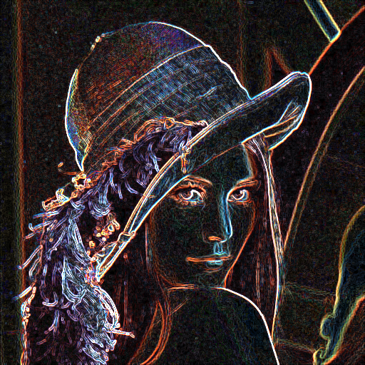
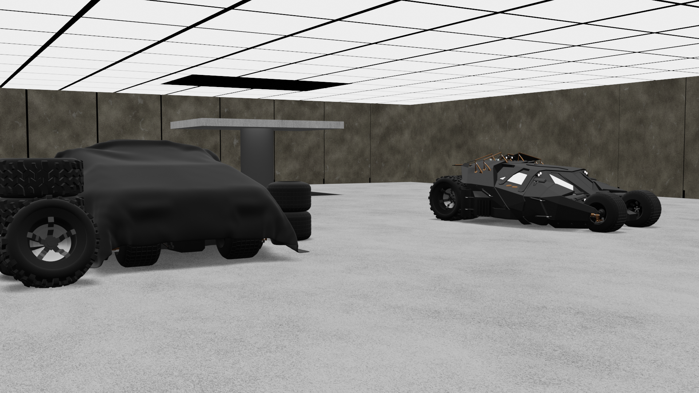

# PGA - David Mikulka

## 2D (konvoluce - detekce hran)
- plugin do Gimpu na detekci hran

[Odkaz na dokumentaci](2D/dokumentace.adoc)

## 3D (Generování objektů - Batgarage)
- plugin do Blenderu na generování garáže pro Batmobil (inspirace z filmu The Dark Knight)

[Odkaz na dokumentaci](3D/dokumentace.adoc)

