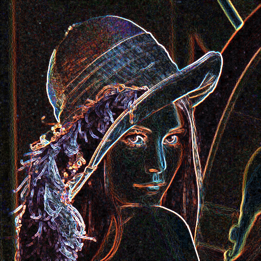

# PGA - David Mikulka

## 2D (konvoluce - detekce hran)
- plugin do Gimpu na detekci hran

link:2D/dokumentace.adoc[Odkaz na dokumentaci]

## 3D (Generování objektů - Batgarage)
- plugin do Blenderu na generování garáže pro Batmobil (inspirace z filmu The Dark Knight)

link:3D/dokumentace.adoc[Odkaz na dokumentaci]

image::3D/images/render2.png[width=1080]